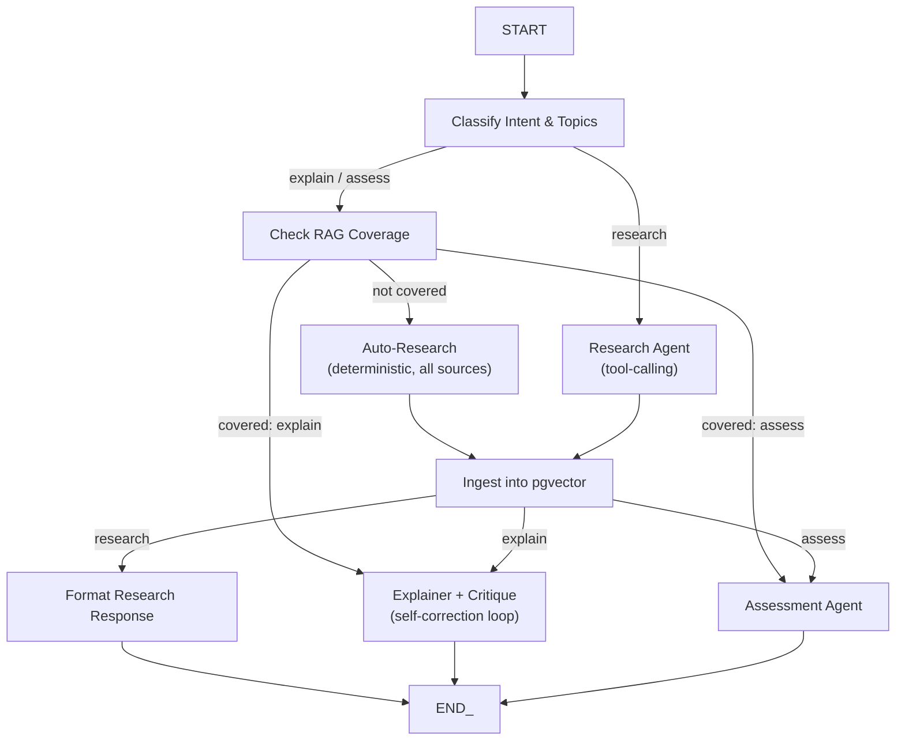

# Learn Loop

A self-learning personal research and tutoring agent. Unlike a stateless Q&A bot, Learn Loop remembers what you've been corrected on and adapts future explanations to it — the core idea being **retrieval over your own experience**, not model retraining.

**Live app:** https://learn-loop-brown.vercel.app
**API:** https://learn-loop-api.onrender.com

---

## What makes this "self-learning"

Most of what's below is a fairly standard multi-agent RAG stack. The one piece that isn't: every explanation you get and every quiz you take feeds back into a per-user memory store (mem0), and the *next* explanation on that topic is generated after retrieving what you got wrong or reacted to — before a word of new text is written. Two independent signals close this loop:

1. **Explicit reaction (HITL):** after an explanation, you can say "too basic," "use an analogy," "I already know this" — stored verbatim as a correction tied to that topic.
2. **Quiz performance:** wrong answers are summarized and stored as knowledge gaps tied to that topic.

Both get retrieved and folded into the prompt the next time that topic (or a related one) comes up, and the Explainer is explicitly instructed to target those gaps rather than give a generic overview.

---

## Architecture

Everything runs through a single LangGraph state machine (the "Supervisor"). It classifies intent, decides whether existing knowledge covers the request, researches if not, then dispatches to the right agent.



### The agents

**Supervisor** (`app/agents/supervisor/`) — the graph above. Classifies the request into `research` / `explain` / `assess` and extracts every distinct topic mentioned (a compound question like *"explain X and compare it to Y"* produces two topics, not one flattened string). Checks per-topic whether the RAG store already has coverage; if not, silently researches before handing off — the user never sees a "no data found" dead end.

**Research Agent** (`app/agents/research_agent.py`) — a LangGraph tool-calling ReAct agent with five tools: arXiv, OpenAlex, Semantic Scholar, and Wikipedia (all structured, all get persisted to pgvector), plus Tavily for live/current web results (used for grounding the immediate answer, not persisted — no stable "paper" identity to store). Used for explicit *"research X"* requests, where letting the model choose which sources fit is actually desirable.

**Auto-Research** (`app/agents/supervisor/nodes.py::auto_research_node`) — a deterministic sibling to the above, used whenever `explain`/`assess` hit a topic with no existing coverage. Calls all five sources directly rather than trusting an LLM to choose to call them — this exists because Groq's tool-calling reliability on `gpt-oss-120b` proved inconsistent for autonomous grounding, and a silent gap here means the Explainer refusing to answer.

**Explainer + Critique** (`app/agents/explainer_agent.py`) — generates an explanation grounded only in retrieved chunks, then a separate Critique pass fact-checks it against those same chunks and forces revisions (up to 3) until it passes or is returned with an explicit unresolved-issue warning rather than silently shipping an ungrounded answer. Pulls personalization context from mem0 before generating, and supports multi-topic requests with an explicit comparison instruction when more than one topic is present.

**Assessment Agent** (`app/agents/assessment_agent.py`) — generates short-answer quiz questions from the same RAG chunks, grades free-text answers via LLM-as-judge (not exact match), and writes a knowledge-gap summary to mem0. Quiz sessions persist to Postgres (not in-memory), so they survive a backend restart and a page reload mid-quiz.

**Quick Actions** (`app/agents/quick_actions.py`) — "Continue research," "Quiz me on this conversation," "Explain a related concept." Deliberately *not* routed through intent classification — these are fixed dispatch targets triggered directly by UI buttons, since after the tool-calling reliability issues above, a free-text-classified path for these felt like an unnecessary risk for something this simple.

---

## Tech stack

**Backend** — FastAPI (fully async), LangGraph (agent orchestration), `langchain-groq` → Groq's `openai/gpt-oss-120b` for all reasoning, `asyncpg` for the database pool, `mem0ai` for personalization memory, `python-jose` for local JWT verification (JWKS/RS256, cached), `httpx` for outbound calls.

**Frontend** — React 19 + Vite, Tailwind CSS v4, `react-router-dom`, `axios`, `react-markdown` + `remark-gfm` for rendering agent responses, native browser `WebSocket` for the live chat connection (with reconnect/backoff).

**Data & Auth** — Supabase: Postgres + `pgvector` for the RAG store, and Supabase Auth (Google OAuth via PKCE) for identity. mem0's hosted platform for the personalization layer, entirely separate from the RAG store.

**External APIs** — Groq (LLM), HuggingFace Inference API (`sentence-transformers/all-MiniLM-L6-v2` for embeddings — moved off local `sentence-transformers`/PyTorch specifically to fit Render's free-tier memory limit), Tavily (live web search), OpenAlex, Semantic Scholar, arXiv, Wikipedia (research sources), Pollinations.ai (free, keyless image generation for concept illustrations).

**Deployment** — Backend on Render (Docker), frontend on Vercel, CI/CD via GitHub Actions (lint + build + Docker-build verification on every PR; deploy to both platforms via their deploy hooks only after CI passes on `main`).

---

## Database schema

Everything lives in Supabase Postgres. Two categories: a per-user RAG corpus, and conversation/quiz state.

```sql
-- RAG corpus — one row per chunk, scoped per user so research isn't shared across accounts
create table paper_chunks (
    id uuid primary key default gen_random_uuid(),
    paper_title text not null,
    paper_url text,
    source text,                  -- 'arxiv' | 'openalex' | 'semantic_scholar' | 'wikipedia' | 'tavily'
    chunk_text text not null,
    embedding vector(384) not null,
    metadata jsonb default '{}'::jsonb,   -- { year, citation_count }
    user_id text not null,
    created_at timestamptz default now()
);
create index paper_chunks_user_idx on paper_chunks(user_id);
create index paper_chunks_embedding_idx on paper_chunks using hnsw (embedding vector_cosine_ops);

-- Cosine similarity search, scoped to one user
create function match_paper_chunks(query_embedding vector(384), match_count int, p_user_id text)
returns table (id uuid, paper_title text, paper_url text, source text, chunk_text text, similarity float)
language plpgsql as $$
begin
    return query
    select paper_chunks.id, paper_chunks.paper_title, paper_chunks.paper_url,
           paper_chunks.source, paper_chunks.chunk_text,
           1 - (paper_chunks.embedding <=> query_embedding) as similarity
    from paper_chunks
    where paper_chunks.user_id = p_user_id
    order by paper_chunks.embedding <=> query_embedding
    limit match_count;
end;
$$;

-- Conversation history (sidebar)
create table conversations (
    id uuid primary key default gen_random_uuid(),
    user_id text not null,
    title text,                   -- LLM-generated, 5 words, on the first message
    created_at timestamptz default now(),
    updated_at timestamptz default now()
);
create index conversations_user_idx on conversations(user_id, updated_at desc);

create table chat_messages (
    id uuid primary key default gen_random_uuid(),
    conversation_id uuid not null references conversations(id) on delete cascade,
    role text not null,           -- 'user' | 'assistant'
    content text,
    metadata jsonb default '{}'::jsonb,   -- { intent, topic, image_path, quiz_id }
    created_at timestamptz default now()
);
create index chat_messages_conversation_idx on chat_messages(conversation_id, created_at);

-- Quiz sessions — persisted so a reload or restart doesn't lose an in-progress quiz
create table quiz_sessions (
    id uuid primary key default gen_random_uuid(),
    user_id text not null,
    conversation_id uuid references conversations(id) on delete cascade,
    topic text not null,
    questions jsonb not null,     -- includes expected_answer, never sent to the client until graded
    submitted boolean default false,
    results jsonb,
    created_at timestamptz default now()
);
create index quiz_sessions_user_idx on quiz_sessions(user_id);
```

---

## API surface

**Primary interface — WebSocket** (`/api/v1/ws/learn`): one persistent connection per session. Client sends `{ token, conversation_id, message }` or `{ type: "action", action, token, conversation_id }`; server streams `{ type: "phase", phase, label }` events as each graph node completes (what the UI's live status indicator renders), followed by one `{ type: "result", ... }`. `auth_error` and `error` types are distinguished so the client can tell "your session expired" apart from "that request failed."

**REST endpoints** (`/api/v1/...`): `auth/login/google` + `auth/callback` (OAuth/PKCE flow), `conversations` + `conversations/{id}/messages` (sidebar history), `assess/{quiz_id}` + `assess/{quiz_id}/submit` (quiz retrieval/grading), `learn/image/{filename}` (generated diagrams), `learn/message` (non-streaming fallback for the same flow the WebSocket drives).

---

## Running it locally

```bash
# Backend
uv sync
uvicorn app.main:app --reload --reload-dir app
# needs a .env with: GROQ_API_KEY, OPENALEX_API_KEY, SUPABASE_DB_URL, SUPABASE_URL,
# SUPABASE_PUBLISHABLE_KEY, MEM0_API_KEY, TAVILY_API_KEY, HF_TOKEN,
# FRONTEND_URL (defaults to localhost:5173), BACKEND_URL (defaults to localhost:8000)

# Frontend
cd frontend
npm install
npm run dev
# needs a .env with: VITE_API_BASE, VITE_WS_URL (both default to localhost for local dev)
```

---

## Known limitations

- **Render free tier cold-starts.** No traffic for 15 minutes → the next request pays a startup cost. Fine for occasional demo use, not for a production SLA.
- **Live web results (Tavily) aren't persisted.** They ground the immediate answer but won't be there on a repeat question about the same topic — only the four structured, citable sources build lasting RAG coverage.
- **The tool-calling Research Agent has a known reliability ceiling** on Groq's current `gpt-oss-120b` (documented, current-generation issue, not specific to this project) — the deterministic Auto-Research fallback exists specifically to route around it for anything the app does on its own initiative.