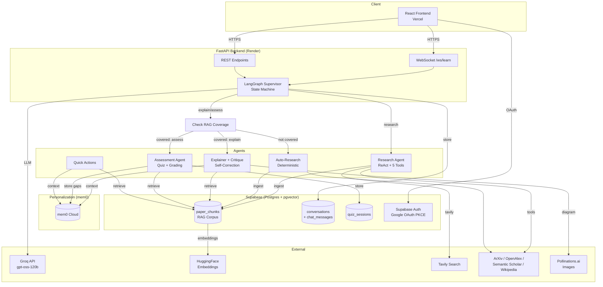

# Learn Loop

A self-learning personal research and tutoring agent. Unlike a stateless Q&A bot, Learn Loop remembers what you've been corrected on and adapts future explanations to it — the core idea being **retrieval over your own experience**, not model retraining.

**Live app:** https://learn-loop-brown.vercel.app  
**API:** https://learn-loop-api.onrender.com  
**Health check:** https://learn-loop-api.onrender.com/health

---

## Architecture

---

## Quick Links

| Area | Document |
|------|----------|
| 🏗️ **Architecture Deep Dive** | [docs/architecture.md](docs/architecture.md) |
| 🛠️ **Tech Stack** | [docs/tech-stack.md](docs/tech-stack.md) |
| 🚀 **Local Setup** | [docs/setup.md](docs/setup.md) |
| 📊 **Database Schema** | [docs/schema.md](docs/schema.md) |
| 🔌 **API Reference** | [docs/api.md](docs/api.md) |
| ⚠️ **Known Limitations** | [docs/limitations.md](docs/limitations.md) |

---

## What Makes This "Self-Learning"

Every explanation and quiz feeds back into a per-user memory store (mem0), and the *next* explanation on that topic retrieves what you got wrong or reacted to — **retrieval over your own experience**.

Two independent signals close the loop:

1. **Explicit reaction (HITL):** After an explanation, you can say "too basic," "use an analogy," "I already know this" — stored verbatim as a correction tied to that topic.
2. **Quiz performance:** Wrong answers are summarized and stored as knowledge gaps tied to that topic.

Both get retrieved and folded into the prompt the next time that topic (or a related one) comes up, and the Explainer explicitly targets those gaps rather than giving a generic overview.