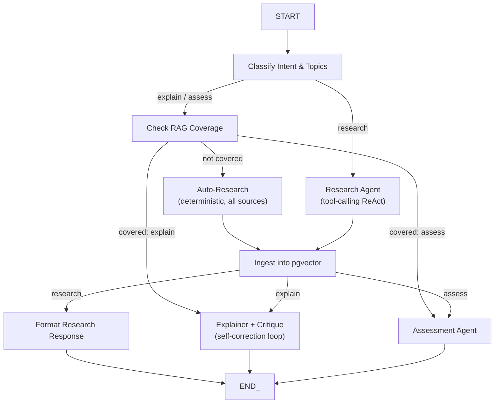

# Architecture Deep Dive

## Overview

Everything runs through a single LangGraph state machine (the **Supervisor**). It classifies intent, decides whether existing knowledge covers the request, researches if not, then dispatches to the right agent.

## Supervisor Graph



## Agents

### Supervisor (`app/agents/supervisor/`)

The central orchestrator. Key responsibilities:

- **Intent classification** → `research` / `explain` / `assess`
- **Topic extraction** — A compound question like *"explain X and compare it to Y"* produces two distinct topics, not one flattened string. Each topic flows through the graph independently (coverage check, research, explanation).
- **RAG coverage check** — Per-topic check whether `paper_chunks` already has relevant embeddings
- **Silent research** — If coverage is missing, auto-researches before handing off; user never sees "no data found"

### Research Agent (`app/agents/research_agent.py`)

A LangGraph tool-calling ReAct agent with **five structured tools**:

| Tool | Source | Purpose |
|------|--------|---------|
| `arxiv_search` | arXiv | Recent ML/CS preprints |
| `openalex_search` | OpenAlex | Broad academic coverage |
| `semantic_scholar_search` | Semantic Scholar | CS/AI + citation counts |
| `wikipedia_search` | Wikipedia | Background/definitional context |
| `tavily_search` | Tavily | Live web results (not persisted) |

**Why tool-calling?** For explicit *"research X"* requests, letting the model choose sources is desirable — but Groq's `gpt-oss-120b` tool-calling reliability proved inconsistent.

### Auto-Research (`app/agents/supervisor/nodes.py::auto_research_node`)

**Deterministic fallback** for `explain`/`assess` when RAG has no coverage. Calls all five sources directly rather than trusting the LLM to call tools. Exists specifically because of the tool-calling reliability ceiling — a silent gap here means the Explainer refusing to answer.

### Explainer + Critique (`app/agents/explainer_agent.py`)

1. **Generate** — Explanation grounded only in retrieved chunks + personalization from mem0
2. **Critique** — Separate pass fact-checks against the same chunks
3. **Revise** — Up to 3 iterations until critique says "PASS" or returns with explicit unresolved-issue warning

**Multi-topic support:** When multiple topics are present, the prompt includes an explicit comparison instruction. The Critique checks the *entire* response (including comparison) against sources.

**Personalization:** Pulls learner context from mem0 before generating — gaps/mistakes from past quizzes are explicitly targeted.

### Assessment Agent (`app/agents/assessment_agent.py`)

- Generates **short-answer** quiz questions (not recall/multiple-choice) from RAG chunks
- Grades free-text answers via **LLM-as-judge** (not exact match)
- Writes knowledge-gap summary to mem0
- Quiz sessions persist to Postgres (survive restart/reload)

### Quick Actions (`app/agents/quick_actions.py`)

Fixed dispatch targets triggered by UI buttons — **not** routed through intent classification:

| Action | Description |
|--------|-------------|
| `continue_research` | Find additional/recent sources on last topic |
| `quiz_context` | Quiz on all topics in current conversation |
| `explain_related` | Suggest & explain one related concept |

Deliberately fixed-path after tool-calling reliability issues — unnecessary risk for something this simple.

## Data Flow

```
User Message
    │
    ▼
┌─────────────────────┐
│  Supervisor Graph   │
│  (LangGraph)        │
└─────────┬───────────┘
    │
    ├──► classify_intent → intent + topics
    │
    ├──► check_sources → has_sources?
    │       │
    │       ├── yes + explain → explain_node
    │       ├── yes + assess  → assess_node
    │       └── no            → auto_research → ingest
    │
    └──► research_agent → ingest
```

## WebSocket Streaming

The Supervisor uses `stream_mode="updates"` to emit phase events as each node completes:

```json
{ "type": "phase", "phase": "explain", "label": "Writing explanation" }
```

Followed by final result:

```json
{ "type": "result", "intent": "explain", "topic": "X", "response": "...", "image_path": "https://...", "quiz_id": null }
```